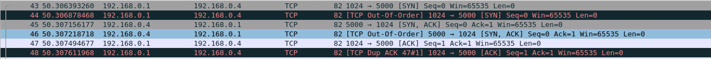

# Lab

**What fields changed as the packet was forwarded?**

As the packet was forwarded the following changed:
- the source and destination UDP port 
- the TTL was decremented 
- the checksum was updated

**Screenshot**

**What node sent this RIP update? To which node was it sent?**

Node C sent this RIP message/response to Node B. 

**What entries are sent in the update? Do you observe instances of split horizon/poison reverse?**

The following are the entries:

- It costs "infinity" to get to interface 1 of Node B 
- It costs "infinity" to get to Node A
- It costs 0 to get to Node C 
- It costs "infinity" to get to interface 0 of Node B 

Yes, there are instances of split horizon/poison reverse in the 1st, 2nd, and 4th entries because those entries for Node C originated from Node B, so when Node C sends their updated table those costs are set to infinity (16). 
